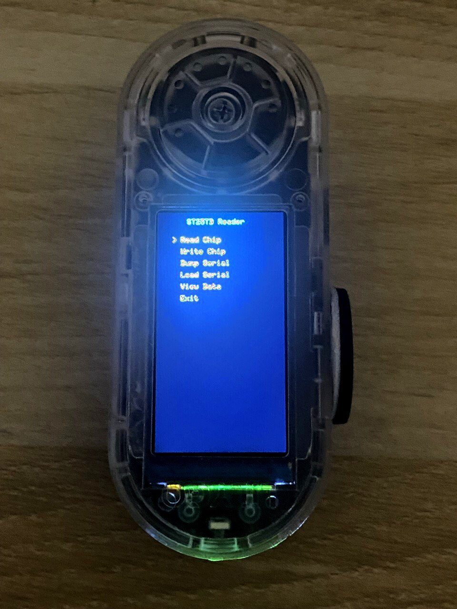
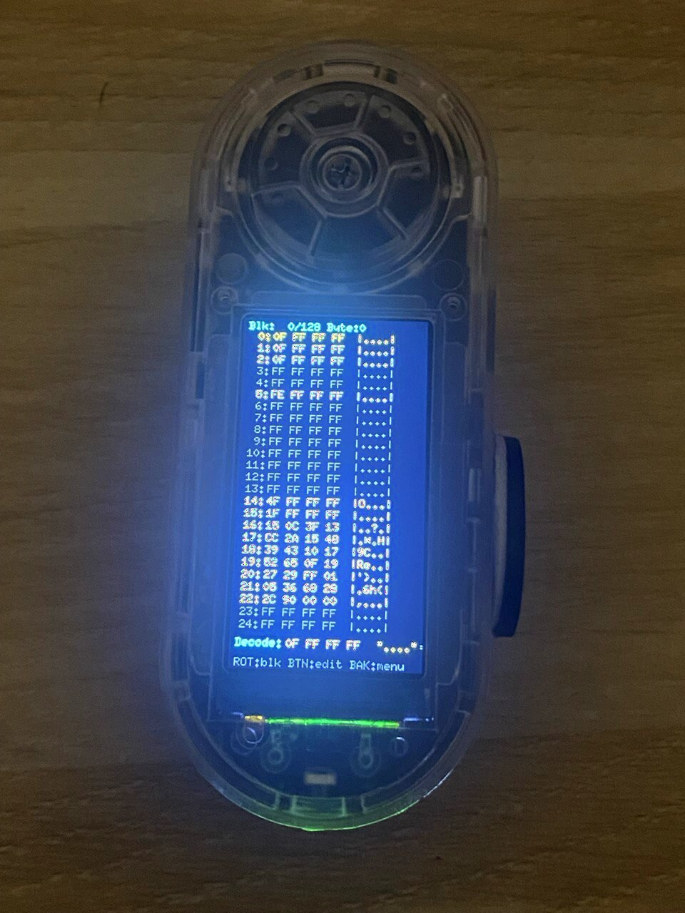

# ST25TB RFID Reader

A Rust firmware for reading and writing **ST25TB RFID chips** (commonly used in printer cartridges) using the **LilyGO T-Embed CC1101** device.


## Photos

<p align="center">
  
  &nbsp;&nbsp;&nbsp;
  
</p>
<p align="center">
  <em>Menu Screen</em>
  &nbsp;&nbsp;&nbsp;&nbsp;&nbsp;&nbsp;&nbsp;&nbsp;&nbsp;&nbsp;&nbsp;&nbsp;&nbsp;&nbsp;&nbsp;&nbsp;&nbsp;&nbsp;&nbsp;&nbsp;&nbsp;&nbsp;&nbsp;
  <em>Chip Data View</em>
</p>

## Features

- **Read ST25TB chips** - Full chip dump (up to 256 blocks)
- **Write ST25TB chips** - Write modified data back to chip
- **Serial Dump** - Export chip data via serial monitor
- **Serial Load** - Import chip data by pasting hex dump
- **TFT Display UI** - Menu navigation with rotary encoder
- **Audio Feedback** - Beep on successful operations

## Hardware

### Required
- **LilyGO T-Embed CC1101** (ESP32-S3)
- **PN532 NFC Module** (connected via I2C)

### Pin Configuration

| Function | GPIO |
|----------|------|
| PN532 SDA | GPIO8 |
| PN532 SCL | GPIO18 |
| PN532 IRQ | GPIO17 |
| PN532 RST | GPIO45 |
| Display CS | GPIO41 |
| Display DC | GPIO16 |
| Display BL | GPIO21 |
| Encoder A | GPIO4 |
| Encoder B | GPIO5 |
| Encoder BTN | GPIO0 |
| Back Button | GPIO6 |
| Power Enable | GPIO15 |

## Building

### Prerequisites

1. Install Rust and ESP toolchain:
```bash
curl --proto '=https' --tlsv1.2 -sSf https://sh.rustup.rs | sh
cargo install espup
espup install
```

2. Source the environment:
```bash
source ~/export-esp.sh
```

### Build Commands

Using `just` (recommended):
```bash
# Install just
cargo install just

# Build
just build

# Flash and monitor
just flash

# Monitor only
just monitor
```

Or manually:
```bash
# Build
cargo build --release

# Flash
cargo espflash flash --port /dev/cu.usbmodem1201 --release

# Monitor
espflash monitor --port /dev/cu.usbmodem1201 --non-interactive
```

## Usage

### Menu Navigation
- **Rotate encoder** - Navigate menu / scroll data
- **Press encoder** - Select / toggle edit mode
- **Back button** - Go back / cancel

### Reading a Chip
1. Select "Read Chip" from menu
2. Place ST25TB chip on PN532 antenna
3. Wait for beep (success) or error message

### Writing a Chip
1. First read or load chip data
2. Select "Write Chip" from menu
3. Place same chip on antenna
4. Wait for verification

### Serial Dump/Load

**Export dump:**
1. Select "Dump Serial"
2. Copy output from serial monitor

**Import dump:**
1. Select "Load Serial"
2. Paste data in format:
```
B000: 0F FF FF FF
B001: 9F FF FF FF
...
END
```
3. Type `END` and press Enter

## Supported Chips

- ST25TB04K (512 bytes)
- ST25TB512 
- ST25TB02K
- SRI512 / SRIX4K (ISO14443-B)

## Project Structure

```
src/
├── main.rs           # Application entry & UI logic
├── board.rs          # Pin definitions
├── drivers/
│   ├── pn532.rs      # PN532 NFC driver (I2C)
│   └── audio.rs      # I2S audio (beep)
├── protocol/
│   └── st25tb.rs     # ST25TB read/write protocol
└── ui/
    ├── display.rs    # TFT display rendering
    └── editor.rs     # Chip data editor
```

## Technical Details

- **MCU**: ESP32-S3 (Dual-core LX7, 240MHz)
- **Framework**: esp-hal (bare metal, no_std)
- **Display**: ST7789V 170x320 TFT
- **NFC**: PN532 via I2C at 100kHz
- **Protocol**: ISO14443-B

## Known Issues

1. **"Observer Effect"** - Device may only work reliably with serial monitor connected (USB power initialization quirk)
2. **PN532 Wakeup** - First SAM config may fail; firmware retries automatically

## License

MIT License - see [LICENSE](LICENSE) file.

## Contributing

Contributions welcome! Please open an issue or PR.

## Acknowledgments

- [esp-hal](https://github.com/esp-rs/esp-hal) - ESP32 Hardware Abstraction Layer
- [LilyGO](https://github.com/Xinyuan-LilyGO/T-Embed-CC1101) - Hardware documentation
- [PN532 Datasheet](https://www.nxp.com/docs/en/user-guide/141520.pdf)
- [ST25TB Datasheet](https://www.st.com/resource/en/datasheet/st25tb04k.pdf)
